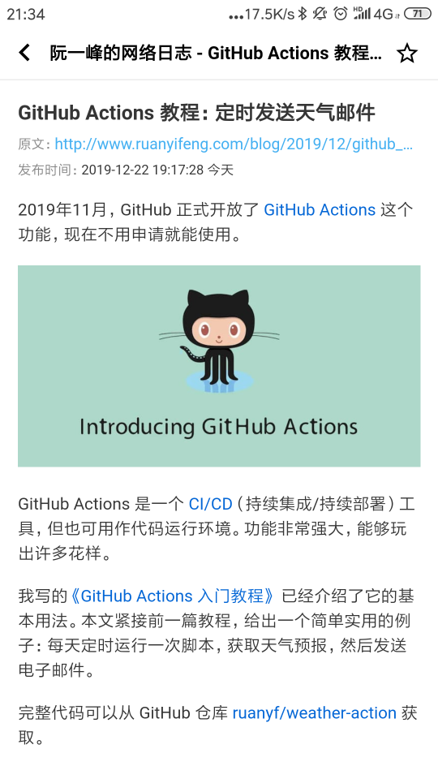

# 蚁阅 ( RSSAnt )

> 让 RSS 更好用，轻松订阅你喜欢的博客和资讯  

### 主要特点

- 为移动端优化，适合随时随地阅读
- 非社交，无广告，无推荐，专注阅读
- 按订阅更新频率区分消息，好文章慢慢看，读资讯一目十行
- 输入博客地址，智能查找订阅，支持批量导入导出
- 智能图片代理，解决图片无法加载问题
- 开源，可以自己部署，也可以直接用在线版

开箱即用地址: https://rss.anyant.com (建议用手机浏览器访问)  




### 部署文档

蚁阅基于Docker部署，服务器环境要求:

- Linux, 2G内存
- Docker

#### 第一步，准备配置文件

配置文件保存为 `~/rssant/rssant.env` 。

```bash
# 关闭DEBUG请置0
RSSANT_DEBUG=1

# 请随机生成一个字符串
RSSANT_SECRET_KEY=SECRET

# 应用的访问地址
RSSANT_ROOT_URL=http://localhost:6789

# 检查订阅的时间间隔，默认30分钟
RSSANT_CHECK_FEED_MINUTES=30

# 请前往GITHUB设置页面申请，不需要Github登录可留空
# GitHub OAuth callback:
# http://<你的域名>/api/v1/accounts/github/login/callback/
RSSANT_GITHUB_CLIENT_ID=
RSSANT_GITHUB_SECRET=

# SMTP邮件功能，不需要注册功能可留空
RSSANT_ADMIN_EMAIL=
RSSANT_SMTP_ENABLE=false
RSSANT_SMTP_HOST=smtp.qq.com
RSSANT_SMTP_PORT=465
RSSANT_SMTP_USE_SSL=true
RSSANT_SMTP_USERNAME=
RSSANT_SMTP_PASSWORD=

# 以下配置保持不动
RSSANT_SCHEDULER_NETWORK=rssant
RSSANT_PG_DB=rssant
RSSANT_PG_HOST=localhost
RSSANT_PG_USER=rssant
RSSANT_PG_PASSWORD=rssant
```

#### 第二步，启动服务

将以下脚本保存为 `~/rssant/start.sh`，其中端口 `6789` 可改为自定义端口。

```bash
#!/bin/bash

docker volume create rssant-data
docker volume create rssant-postgres-data
docker volume create rssant-postgres-logs

docker rm -f rssant
docker run -ti --name rssant -d \
    -p 6789:80 \
    --env-file ~/rssant/rssant.env \
    -v rssant-data:/app/data \
    -v rssant-postgres-data:/var/lib/postgresql/11/main \
    -v rssant-postgres-logs:/var/log/postgresql \
    --log-driver json-file --log-opt max-size=50m --log-opt max-file=10 \
    --restart unless-stopped \
    rssant/box:latest

docker logs --tail 1000 -f rssant
```

启动服务 `bash ~/rssant/start.sh`, 当看到下面的日志时，服务就启动好了。

```bash
# 初始化数据库的日志
I 2019-12-22 11:01:36 scripts.django_db_init:26   extension hstore created
I 2019-12-22 11:01:36 scripts.django_db_init:33   create admin user
I 2019-12-22 11:01:36 scripts.django_db_init:41   update site info
I 2019-12-22 11:01:36 scripts.django_db_init:53   create github social app
# 程序正常运行中的日志
I 2019-12-22 13:16:08 rssant_harbor.actors.rss:418  delete 0 old feed creations
I 2019-12-22 13:16:08 rssant_harbor.actors.rss:423  retry 0 status=UPDATING feed creations
I 2019-12-22 13:16:08 rssant_harbor.actors.rss:429  retry 0 status=PENDING feed creations
```

执行 `docker exec -ti rssant supervisorctl status`, 以下进程状态说明一切正常：

```
api                              RUNNING   pid 9, uptime 0:10:03
async-api                        RUNNING   pid 10, uptime 0:10:03
harbor                           RUNNING   pid 11, uptime 0:10:03
initdb                           EXITED    Dec 22 01:15 PM
nginx                            RUNNING   pid 15, uptime 0:10:03
postgres                         RUNNING   pid 17, uptime 0:10:03
scheduler                        RUNNING   pid 19, uptime 0:10:03
worker                           RUNNING   pid 21, uptime 0:10:03
```

访问 http://localhost:6789/admin/    用户名: admin 密码: admin  
点击页面右上角 "CHANGE PASSWORD" 修改密码。

**大功告成，返回首页即可开始使用了！**

如需停止服务，执行: `docker rm -f rssant`  
如需备份数据，备份 `rssant-postgres-data` 这个卷即可，其他卷可忽略。  

