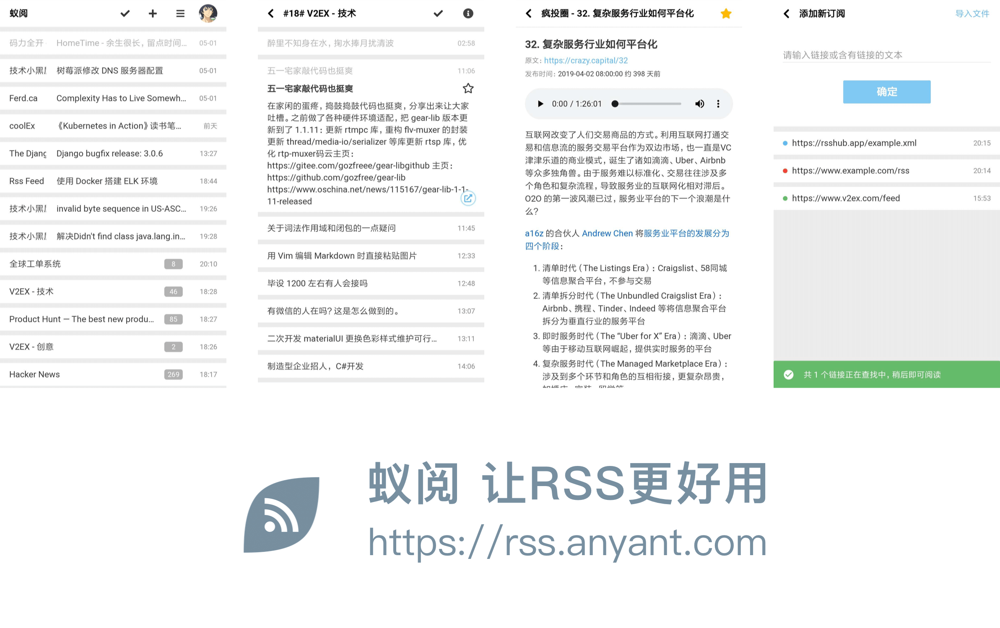

# 蚁阅 ( RSSAnt )

> 让 RSS 更好用，轻松订阅你喜欢的博客和资讯  

### 主要特点

- 非社交，无广告，无推荐，专注阅读
- 为移动端优化，全平台适配，可添加到主屏，沉浸式体验
- 支持订阅播客和视频内容
- 输入链接，智能查找订阅，支持批量导入导出
- 智能图片代理，解决图片无法加载问题
- 智能 RSS 代理，全球 RSS 均可订阅
- 开源，可以直接用在线版，也可以自己部署

开箱即用地址: https://rss.anyant.com

<p>

</p>

## 捐助蚁阅

蚁阅计划于今年年底推出付费功能，价格不会超过5元/月，同时所有功能会继续保持开源。

- 付费功能推出前给蚁阅捐款，可永久免费使用蚁阅全部功能
- 给蚁阅提供反馈和建议，报 Bug 等等，可永久免费使用蚁阅全部功能
- 付费功能推出前注册的用户，一年内均可一折购买蚁阅服务

欢迎大家给蚁阅捐款，支付蚁阅服务器费用 ^_^  
有任何疑问或建议都欢迎与我联系！（**捐款请备注蚁阅账号或邮箱！**）


## 部署文档

蚁阅基于Docker部署，服务器环境要求:

- Linux, 1G 内存
- [Docker](https://developer.aliyun.com/mirror/docker-ce) + [镜像加速器](https://juejin.im/post/5cd2cf01f265da0374189441)

#### 第一步，准备配置文件

配置文件保存为 `~/rssant/rssant.env` 。

```bash
# 关闭DEBUG，请勿在开发测试之外开启DEBUG
RSSANT_DEBUG=0

# 请随机生成一个字符串
RSSANT_SECRET_KEY=SECRET

# 应用的访问地址
RSSANT_ROOT_URL=http://localhost:6789

# 检查订阅的时间间隔，默认30分钟
RSSANT_CHECK_FEED_MINUTES=30

# 请前往GITHUB设置页面申请，不需要Github登录可留空
# GitHub OAuth callback:
# http://<你的域名>/api/v1/accounts/github/login/callback/
RSSANT_GITHUB_CLIENT_ID=
RSSANT_GITHUB_SECRET=

# SMTP邮件功能，不需要注册功能可留空
RSSANT_ADMIN_EMAIL=
RSSANT_SMTP_ENABLE=false
RSSANT_SMTP_HOST=smtp.qq.com
RSSANT_SMTP_PORT=465
RSSANT_SMTP_USE_SSL=true
RSSANT_SMTP_USERNAME=
RSSANT_SMTP_PASSWORD=

# RSS代理功能
# 参考项目 cloudflare_worker/rssant 目录下的说明部署代理
RSSANT_RSS_PROXY_ENABLE=false
RSSANT_RSS_PROXY_URL=https://<your-cloudflare-worker>.workers.dev/rss-proxy
RSSANT_RSS_PROXY_TOKEN=

# 以下配置保持不动
RSSANT_SCHEDULER_NETWORK=rssant
RSSANT_PG_DB=rssant
RSSANT_PG_HOST=localhost
RSSANT_PG_USER=rssant
RSSANT_PG_PASSWORD=rssant
```

#### 第二步，启动服务

将以下脚本保存为 `~/rssant/start.sh`，其中端口 `6789` 可改为自定义端口。

```bash
#!/bin/bash

docker volume create rssant-data || true
docker volume create rssant-postgres-data || true
docker volume create rssant-postgres-logs || true

docker rm -f rssant || true
docker run -ti --name rssant -d \
    -p 6789:80 \
    --env-file ~/rssant/rssant.env \
    -v rssant-data:/app/data \
    -v rssant-postgres-data:/var/lib/postgresql/11/main \
    -v rssant-postgres-logs:/var/log/postgresql \
    --log-driver json-file --log-opt max-size=50m --log-opt max-file=10 \
    --restart unless-stopped \
    guyskk/rssant:latest

docker logs --tail 1000 -f rssant
```

启动服务 `bash ~/rssant/start.sh`, 当看到下面的日志时，服务就启动好了。

```bash
# 初始化数据库的日志
I 2019-12-22 11:01:36 scripts.django_db_init:26   extension hstore created
I 2019-12-22 11:01:36 scripts.django_db_init:33   create admin user
I 2019-12-22 11:01:36 scripts.django_db_init:41   update site info
I 2019-12-22 11:01:36 scripts.django_db_init:53   create github social app
# 程序正常运行中的日志
I 2019-12-22 13:16:08 rssant_harbor.actors.rss:418  delete 0 old feed creations
I 2019-12-22 13:16:08 rssant_harbor.actors.rss:423  retry 0 status=UPDATING feed creations
I 2019-12-22 13:16:08 rssant_harbor.actors.rss:429  retry 0 status=PENDING feed creations
```

执行 `docker exec -ti rssant supervisorctl status`, 以下进程状态说明一切正常：

```
api                              RUNNING   pid 9, uptime 0:10:03
async-api                        RUNNING   pid 10, uptime 0:10:03
harbor                           RUNNING   pid 11, uptime 0:10:03
initdb                           EXITED    Dec 22 01:15 PM
nginx                            RUNNING   pid 15, uptime 0:10:03
postgres                         RUNNING   pid 17, uptime 0:10:03
scheduler                        RUNNING   pid 19, uptime 0:10:03
worker                           RUNNING   pid 21, uptime 0:10:03
```

访问 http://localhost:6789/admin/    用户名: admin 密码: admin  
点击页面右上角 "CHANGE PASSWORD" 修改密码。

**大功告成，返回首页即可开始使用了！**

如需停止服务，执行: `docker rm -f rssant`  
如需备份数据，备份 `rssant-postgres-data` 这个卷即可，其他卷可忽略。  

## 反馈与协作

蚁阅主仓库托管在 [码云](https://gitee.com/anyant/rssant) 上，[GitHub](https://github.com/anyant/rssant) 主要作为镜像仓库。  

码云和 GitHub 均可提交 Issue:
- https://gitee.com/anyant/rssant/issues
- https://github.com/anyant/rssant/issues

码云和 GitHub 也均可提交 Pull Request:
- https://gitee.com/anyant/rssant/pulls
- https://github.com/anyant/rssant/pulls

如果你有码云账号，建议到码云提交 Pull Request。  
非常感谢你的支持！

## 开发环境

#### 系统级依赖

- Linux 或 Mac OSX
- [Docker](https://developer.aliyun.com/mirror/docker-ce) + [镜像加速器](https://juejin.im/post/5cd2cf01f265da0374189441)
- Python + [pyenv](https://github.com/pyenv/pyenv-installer)
- Node.js + [nvm](https://github.com/nvm-sh/nvm#install--update-script)

#### 后端

安装依赖

```
git clone git@gitee.com:anyant/rssant.git
cd rssant
pyenv virtualenv -p python3.7 3.7.7 rssant
pyenv local rssant
pip install -r requirements.txt
```

启动数据库

```
bash ./scripts/postgres_start.sh
```

初始化数据库

```
python manage.py migrate
python manage.py runscript django_db_init
```

开多个终端，分别启动以下服务

```
python manage.py runserver 6788

python -m rssant_async.main

python -m rssant_scheduler.main --concurrency 10

python -m rssant_harbor.main --concurrency 10

python -m rssant_worker.main --concurrency 10
```

访问 http://127.0.0.1:6788/doc/v1/  账号: admin 密码: admin

访问 http://127.0.0.1:6788/docs/v1/#api-v1-feed-import-create   
点击 Interact，输入任意博客地址，例如: `https://www.ruanyifeng.com/blog/` , 然后提交。  
请求应当正常返回，后台任务控制台会输出查找订阅的日志信息。  

测试

```
pytest
```

打包

```
docker build -t rssant/api:latest .
```

#### 前端

```
git clone git@gitee.com:anyant/rssant-web.git
cd rssant-web
npm install
npm run serve
```

访问 http://127.0.0.1:6789/ 即可看到前端页面。

打包

```
docker build -t rssant/web:latest .
```

#### guyskk/rssant

打包

```
bash ./box/build.sh
```

运行

```
bash ./box/run.sh
```
