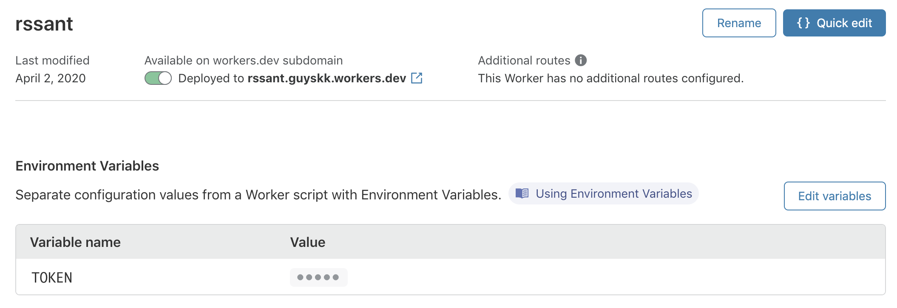

## 快速部署

Cloudflare Worker：https://workers.cloudflare.com/

1. 注册 Cloudflare 账号，免费创建 Worker。
2. 将 `index.js` 代码粘贴上去，点击发布。
3. 随机生成一个密钥，然后在【Environment Variables】页面上设置为 TOKEN。

<p>

</p>

## 配置项

Cloudflare Worker 自带的 workers.dev 域名于 2022-05-09 开始被墙，需要配置自己的域名才能正常访问，配置方式见[官方文档](https://developers.cloudflare.com/workers/platform/routes/#subdomains-must-have-a-dns-record)。

主要步骤：

1. 配置 Cloudflare 托管你的域名
2. 配置一个 DNS AAAA 记录指向 `100::`
3. 配置 Cloudflare Worker Triggers - Route `<your-sub-domain-name>/*`

```bash
RSSANT_RSS_PROXY_ENABLE=true
RSSANT_RSS_PROXY_URL=https://<your-sub-domain-name>/rss-proxy
RSSANT_RSS_PROXY_TOKEN=<YOUR_TOKEN>
```

## 本地开发

https://developers.cloudflare.com/workers/tooling/wrangler/install/

```
npm i @cloudflare/wrangler -g

wrangler preview
wrangler build
wrangler publish
```

**Update Secret**:

```
openssl rand 16 -hex
wrangler secret put TOKEN
```
